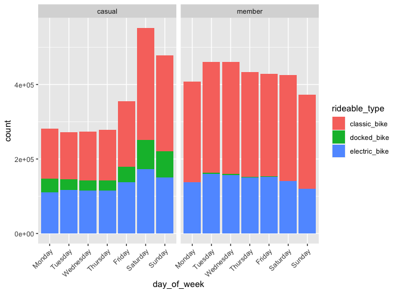
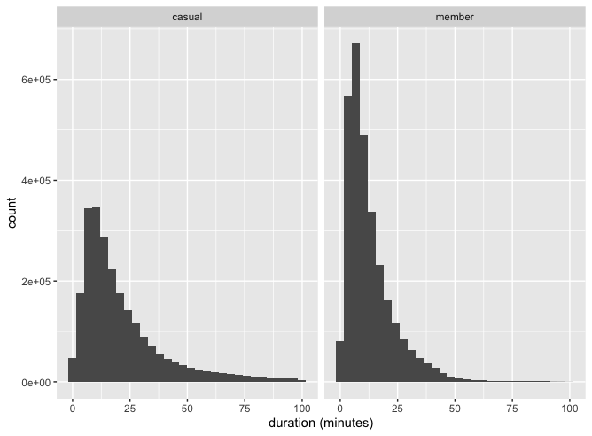
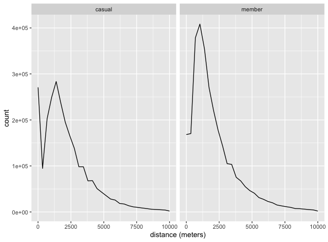
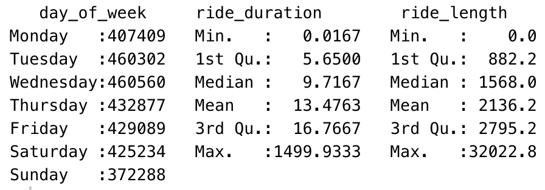
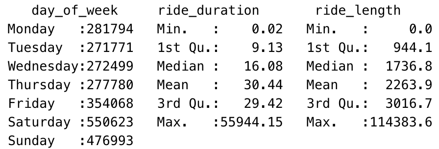

# Google Data Analyst Case Study

During the google data analyst course, we need to do a case study to apply our competences
<br>

## The main question of this case study is : How to convert a casual to a member ?

<br>

All data is available [here](https://divvy-tripdata.s3.amazonaws.com/index.html)

<br>
<br>

## Ask

The questions we need to have answered are:

1. How do annual members and casual riders use Cyclistic bikes differently?
2. Why would casual riders buy Cyclistic annual memberships?
3. How can Cyclistic use digital media to influence casual riders to become members?

## Prepare

During the prepare step, we need to download the data and store it. The data is split into 12 zip files, each containing a dataset corresponding to one month. I downloaded the last 12 months zip files and extracted them into one folder. We don't need to convert the data because the files format is csv.

## Process


I first started doing the process phase on RStudio but after several latency issues, I decided to use Python with Jupiter NoteBook.

### Packages import

We need to import pandas to import all csv files, numpy to make calculations and datetime to make date conversions.

```python
import pandas as pd
import numpy as np
import datetime
```

### Real csv file

```python
df1 = pd.read_csv('202111-divvy-tripdata.csv')
df2 = pd.read_csv('202110-divvy-tripdata.csv')
df3 = pd.read_csv('202109-divvy-tripdata.csv')
df4 = pd.read_csv('202108-divvy-tripdata.csv')
df5 = pd.read_csv('202107-divvy-tripdata.csv')
df6 = pd.read_csv('202106-divvy-tripdata.csv')
df7 = pd.read_csv('202105-divvy-tripdata.csv')
df8 = pd.read_csv('202104-divvy-tripdata.csv')
df9 = pd.read_csv('202103-divvy-tripdata.csv')
df10 = pd.read_csv('202102-divvy-tripdata.csv')
df11 = pd.read_csv('202101-divvy-tripdata.csv')
df12 = pd.read_csv('202012-divvy-tripdata.csv')
```

### Concat all dataset into one

```python
df = pd.concat([df1,df2,df3,df4,df5,df6,df7,df8,df9,df10,df11,df12])
```

### Display information about dataset

```python
print((len(df.index),len(df.columns)))
```

We have **5479096** rows and **13** columns.

Now we want to know the names of the columns in our dataset.

```python
df.columns
```

### Columns details

We also want to see what the data looks like

```python
df.head()
```

Drop duplicated data

```python
df.drop_duplicates().count()
```

We notice that we have no change in the number of lines, so we have no duplicate data.

### Now let’s calculate the distance travelled in meters

I created a function to do this calculation. It returns the distance in metres.

```python
def distance(lat1, lon1, lat2, lon2, R=6371):
    lat1, lon1, lat2, lon2 = np.radians([lat1, lon1, lat2, lon2])
        
    dlon = lon2 - lon1
    dlat = lat2 - lat1
    a = np.sin(dlat/2.0)**2 + np.cos(lat1) * np.cos(lat2) * np.sin(dlon/2.0)**2
    c = 2 * np.arctan2(np.sqrt(a), np.sqrt(1-a))
    
    return R * c * 1000
```

You can use this function to do the calculation. 

A new column is created for the distance travelled.

```python
df['ride_length'] = distance(df['start_lat'],df['start_lng'],df['end_lat'],df['end_lng'])
```

### Calculates travel time in minutes

Data must be converted to date format with pandas

```python
df['started_at'] = pd.to_datetime(df['started_at'])
df['ended_at'] = pd.to_datetime(df['ended_at'])
```

```python
df['ride_duration'] = df['ended_at'].astype(int)/ 10**9 - df['started_at'].astype(int)/ 10**9
# Convert to minutes
df['ride_duration'] = df['ride_duration']/60
```

Display values

```python
df[['started_at','ended_at','ride_duration']].sort_values(by=['ride_duration']).head(5)
```

Output:

|  | started_at | ended_at | ride_duration |
| --- | --- | --- | --- |
| 61163 | 2020-12-15 12:10:14 | 2020-11-25 08:00:16 | -29049.966667 |
| 26808 | 2020-12-15 11:35:39 | 2020-11-25 07:40:56 | -29034.716667 |
| 25965 | 2020-12-15 11:34:23 | 2020-11-25 08:00:15 | -29014.133333 |
| 87858 | 2020-12-15 12:12:43 | 2020-11-25 08:42:16 | -29010.450000 |
| 90888 | 2020-12-15 11:34:38 | 2020-11-25 08:09:43 | -29004.916667 |

We see that we have negative durations. Delete negative durations.

```python
df = df[df['started_at'] < df['ended_at']]
```

### Create day_of_week columns

```python
df['day_of_week'] = df['started_at'].dt.day_name()
```

Let’s take a look at the breakdown over the days of the week

```python
df['day_of_week'].value_counts()
```

## Calculations on different variable

### Ride Length mean

```python
np.round(df['ride_length'].mean(), 1)
```

### Ride Length max

```python
np.round(df['ride_length'].max(), 1)
```

### Day of week mode

```python
df['day_of_week'].mode()
```

### Display final data set information

```python
print((len(df.index),len(df.columns)))
```

We have **5478022** rows and **16** columns.

Now save the final dataset.

```python
df.to_csv("cs1_df.csv")
```

## Analyze

During the analysis phase, we need to process and clean up the data. 

We will use RSudio on our dataset to be able to view the data.

### First we have to load some packages

```r
library(dplyr)
library(readr)
library(tidyverse)
```

### Load file

```r
df <- read.csv("cs1_df.csv",header=T)
```

### Now we will plot a graph bars to display weekly frequency distribution of the member and casual customers with bike types

```r
df$day_of_week <- factor(df$day_of_week, levels = c("Monday","Tuesday","Wednesday","Thursday","Friday","Saturday","Sunday"))

ggplot(df)+
  geom_bar(mapping = aes(x=day_of_week, fill=rideable_type)) +
  facet_wrap(~member_casual)+
  theme(axis.text.x = element_text(angle = 45,hjust = 1))
```



## Observation

- The use of casuals is much higher on weekends, especially on Saturdays, unlike members.
- The casual use is much lower during the week unlike that of the members. The members are probably people who use bicycles to get to work.
- Members have a preference for classic bikes.
- The casuals are the only ones who use the docked bike.

### We want to plot the differences in duration between members and casuals

```r
ggplot(filter(df, df$ride_duration < 100))+
  geom_histogram(mapping = aes(x=ride_duration))+
  facet_wrap(~member_casual)+
  scale_x_continuous(name = "duration (minutes)")
```



## Observation

- We observe that members do a lot more short-term trips than casual employees do.

### We want to plot distance traveled in meters for casuals and members

Filter plot with distance < 10km

```r
ggplot(filter(df, df$ride_length < 10000))+
  geom_freqpoly(mapping = aes(x=ride_length))+
  facet_wrap(~member_casual) +
  scale_x_continuous(name = "distance (meters)", limits=c(0, 10000))
```



## Observation

- We observe that members travel shorter distances than casuals.

### Now let’s create two datasets for both categories, member and casual

```r
df_member <- filter(df, member_casual=="member")
df_casual <- filter(df, member_casual=="casual")
```

## Compare this two dataset

```r
summary(drop_na(select(df_member, c("day_of_week","ride_duration","ride_length"))))
```



```r
summary(drop_na(select(df_casual, c("day_of_week","ride_duration","ride_length"))))
```



With this comparison we notice that the mean distance traveled is approximately equal for our two groups. Average travel time for members is about 14 minutes versus 30 minutes for casuals.

## Share

### Problem of the case study

How to convert a casual to a member ?

The answer to this question is quite complexe, but we have made the following observations:

- Saturday is the day with the most activity.
- The mean ride length of all users is 2200 meters.
- The maximum duration travelled is abnormally long in the casuals, that is to say 38 days.
- The classic bike is the most popular in both cases.

With our observations, the following suggestions can be made:

- It would certainly be relevant to raise the price on the weekend. It would become more profitable for casual users to become a member.
- We are also in a period where bike services are in high demand. It may be appropriate to offer rapid repair and restoration services. This idea, nevertheless, requires further market research and analysis.
- We are currently in a world where the environment is at the heart of our thinking. Why not do a targeted campaign to show people the benefits of using bicycles for the planet.
